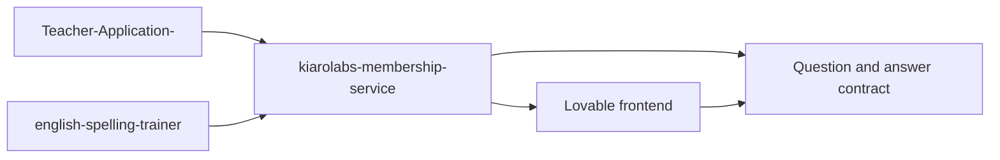
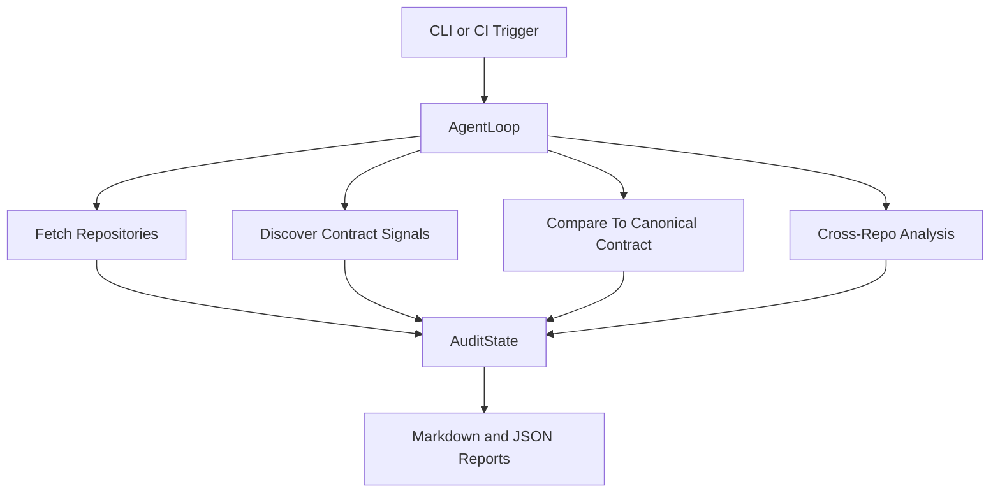

# Audit Agent Architecture

## Mission

Ensure that question generation and answer validation remain accurate across:

- source apps that request question generation
- membership service engines that create the questions
- frontend and backend layers that validate user answers

## System View

## Operating Model

The agent is organized as a phase-based loop rather than a single flat scan.

## Core Components

### Agent Loop

The orchestrator lives in [agent_loop.py](C:/Users/bda50/Documents/Codex/2026-04-22-question-can-i-create-a-new/audit-agent/src/audit_agent/agent_loop.py).

Responsibilities:

- sequence audit phases
- preserve shared state between phases
- capture phase-level failures without throwing away the whole run

### Audit State

The shared state object contains:

- metadata
- canonical contract
- scan configuration
- fetched repository files
- discovery results
- contract observations
- findings
- notes
- errors

### Canonical Contract Registry

The source of truth lives in [canonical_contract.json](C:/Users/bda50/Documents/Codex/2026-04-22-question-can-i-create-a-new/audit-agent/config/canonical_contract.json).

It defines:

- required question fields
- optional question fields
- supported question types
- answer field expectations
- normalization vocabulary
- severity guidance

This is what turns the tool from subjective scanning into contract-aware auditing.

## Audit Phases

### 1. Fetch Repositories

Mode-specific:

- `local`: walk local checkouts and read text files
- `github`: fetch repository trees, prioritize likely contract files, fetch blob contents, cache results

### 2. Discover Contract Signals

The agent looks for:

- API clients and request builders
- answer submission and validation handlers
- DTOs, schemas, models, and interfaces
- hardcoded assumptions and mock payloads
- question and answer field names
- question type tokens
- normalization signals

### 3. Compare To Canonical Contract

The agent evaluates:

- missing required question fields
- unsupported question types
- missing answer normalization vocabulary
- reduced confidence when expected fields are not visible in code

### 4. Cross-Repo Analysis

The generator service acts as the practical baseline.

The agent checks whether consumer repos expose the same question field vocabulary and flags drift between:

- generated payload assumptions
- source app rendering assumptions
- answer validation assumptions

## Severity Model

Severity guidance is documented in the canonical contract and applied consistently:

- `critical`: wrong answer grading, wrong answer key, or broken required fields
- `high`: broken cross-repo contract or unclear correctness path
- `medium`: partial evidence or missing expected signals
- `low`: naming drift or maintainability issues that reduce audit confidence

## Finding Schema

Each finding includes:

- stable run-local ID
- severity
- category
- title
- repo
- path
- expected behavior
- observed behavior
- evidence
- recommendation
- confidence
- auto-fixable flag
- optional line range

## GitHub Mode Details

GitHub mode uses the GitHub REST API and a token with repository read access.

Implementation details:

- recursive tree fetch
- path prioritization toward high-risk files
- blob fetch cap per repo
- on-disk response cache under `.cache/github/`

## Why This Is Still Not Fully Autonomous

This version is more agent-like than the initial scaffold, but it still has clear limits:

- discovery is heuristic and term-based, not AST-based
- it does not yet derive exact DTO schemas from code
- it does not yet inspect Git diffs or PR deltas
- it does not yet validate runtime API or DB behavior

## Best Next Enhancements

- AST extraction for TypeScript and Python contracts
- diff mode for CI and PR gating
- fixture replay against staging
- DB schema comparison
- PR comment publishing
